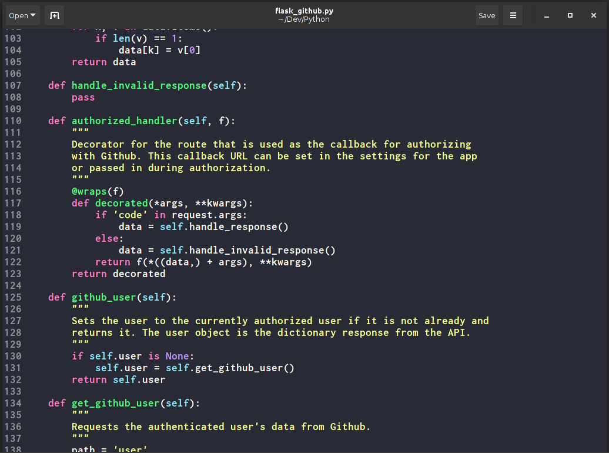

# Dracula for [Gedit](https://wiki.gnome.org/Apps/Gedit)

> A dark theme for [Gedit](https://wiki.gnome.org/Apps/Gedit).



## Install

1. Download the raw file:

 ```bash
 $ wget https://raw.githubusercontent.com/richin13/gedit/master/gedit/dracula.xml
 ```

2. Move the file to gedit style's folder

  ```bash
  $ mv dracula.xml $HOME/.local/share/gedit/styles/
  ```

3. Activate in Gedit's preferences dialog

## Team

This theme is maintained by the following person(s) and a bunch of [awesome contributors](https://github.com/dracula/gedit/graphs/contributors).

| [](https://github.com/richin13) |
--- | ---
|[Ricardo Madriz](https://github.com/richin13)|

## License

[MIT License](./LICENSE)
